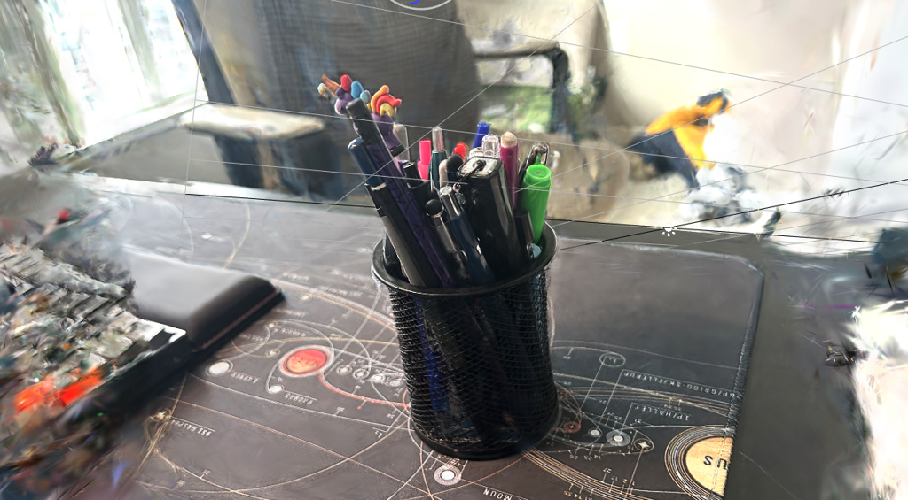

# Colab COLMAP 3D Gaussian Splatting

This project provides a streamlined way to run [COLMAP](https://colmap.github.io/) and 3D Gaussian Splatting (3DGS) pipelines in Google Colab. It enables users to perform 3D scene reconstruction from images directly in the cloud, making photogrammetry and neural graphics more accessible.

## Features

- **COLMAP Integration:** Automates the process of Structure-from-Motion (SfM) and Multi-View Stereo (MVS) using COLMAP, generating camera poses and sparse/dense point clouds from image sets.
- **3D Gaussian Splatting (3DGS):** Quickly reconstructs and visualizes 3D scenes using recent 3DGS techniques, allowing high-quality and efficient scene rendering.
- **Colab-friendly:** No local GPU required. The notebooks are set up to use free or Pro Google Colab GPU resources.
- **Easy-to-use Workflow:** Simple instructions for uploading images, running the full pipeline, and visualizing the results.

## Usage

1. **Open the Google Colab notebook** provided in this repository.
2. **Upload your dataset** of images or use provided sample datasets.
3. **Run the cells** to:
    - Install dependencies (COLMAP, 3DGS, visualization tools)
    - Process images through COLMAP for camera and point cloud reconstruction
    - Apply 3DGS for scene rendering and visualization
4. **Download or view** the reconstructed 3D models/outputs.

## Requirements

- A Google account
- Access to [Google Colab](https://colab.research.google.com/)
- Images of your scene (JPG/PNG)

All dependencies are installed in the notebook—no local setup needed.

## Output Example

Visualized in [PLAYCANVAS](https://playcanvas.com/):

## References

- [COLMAP: Structure-from-Motion and Multi-View Stereo](https://colmap.github.io/)
- [3D Gaussian Splatting Papers & Projects](https://github.com/graphdeco-inria/gaussian-splatting)

## License

This repository is distributed under the MIT License.

## Acknowledgements

Special thanks to the authors and contributors of COLMAP and the 3DGS community for open-sourcing their research and tools.
